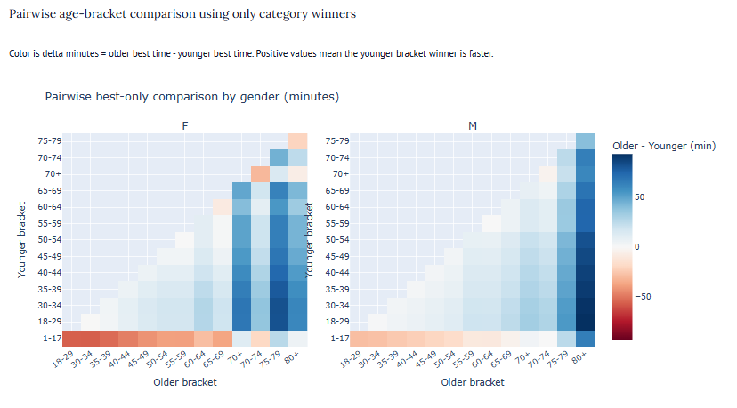
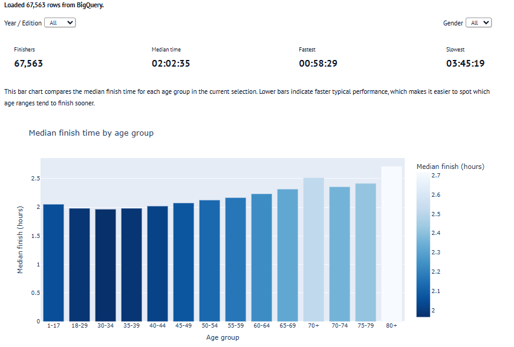
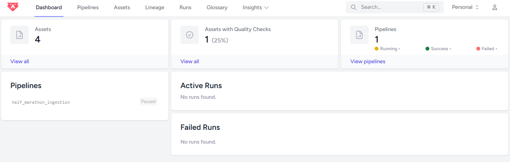
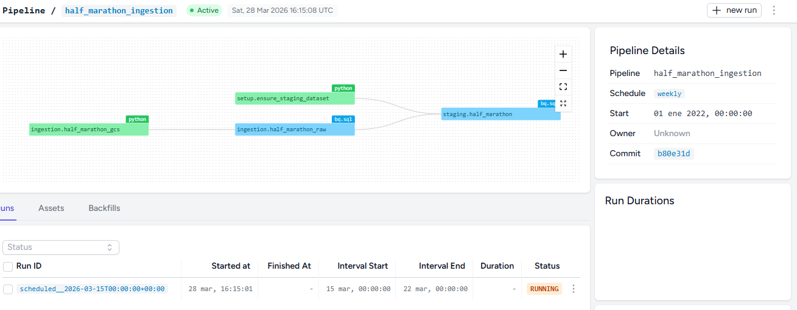

# Buenos Aires Half Marathon (21K) Analytics

[](https://buenos-aires-half-marathon-age-group.onrender.com/)



## Context
This project is the final submission for the 2026 DataTalks Data Engineering Zoomcamp. It demonstrates an end-to-end analytics workflow: ingestion, transformation, warehousing, and interactive analysis.

## Problem Statement
How does performance vary by age group and gender in the Buenos Aires Half Marathon, and are younger runners significantly faster than older runners?
Data discovery was done using notebook data_discovery.ipynb

## Architecture
Source -> Data Lake (GCS) -> Data Warehouse (BigQuery) -> Dashboard (Marimo)

## Project Structure

```
├── half-marathon-bruin/          # Bruin ELT pipeline
│   └── pipeline/
│       └── assets/
│           ├── ingestion/        # Kaggle → GCS → BigQuery raw
│           ├── staging/          # SQL transforms + data quality checks
│           └── setup/            # Dataset provisioning
├── half-marathon-marimo/
│   └── buenos_aires_half_marathon_dashboard.py  # Interactive dashboard
├── terraform/                    # GCP infrastructure (datasets, service account)
├── data_discovery.ipynb          # Exploratory analysis
├── credentials.json              # GCP service account key (not committed)
└── render.yaml                   # Render service setup
```

## Technology Stack
- Bruin Cloud for ELT
- Google Cloud Storage for lake storage
- BigQuery for warehouse 
- SQL for staging and data quality logic
- Marimo + Plotly for dashboarding and hypothesis testing
- Render for hosting and deployment of the Marimo app

## Pipeline Overview
1. Ingest raw marathon data to GCS.
2. Load data from GCS into BigQuery raw tables.
3. Transform into staging with cleaning and standardization.
4. Serve the curated table to a Marimo dashboard.

Main ingestion assets:
- half-marathon-bruin/pipeline/assets/ingestion/half_marathon_to_gcs.py
- half-marathon-bruin/pipeline/assets/ingestion/half_marathon_to_bq.sql

## Data Model
The model uses incremental loading and edition-level deduplication.

Key design choices:
- `edition` is converted into `edition_date` (`YYYY-01-01`) using `SAFE_CAST` to enforce a proper DATE type for partitioning, date-based filtering, and chronological ordering.
- Partitioning: `edition_date` to reduce scanned data and query cost for year-based filtering, trend analysis, and incremental loads by race edition.
- Clustering: `gender` and `age_group` to optimize queries filtered by these fields.
- Time parsing to standard numeric field: `chip_time_hours`
- Deduplication with `ROW_NUMBER()`
- Data quality checks via Bruin metadata
- User identity anonymization to protect participant privacy, reduce re-identification risk, and ensure the analysis focuses on aggregated performance patterns rather than identifiable individuals

## Utility of This Analysis
This analysis is useful in three ways:

1. Performance benchmarking:
It shows expected finish-time ranges by age group and gender, helping runners compare outcomes against peers.

2. Event planning and segmentation:
Organizers can identify participation/performance patterns by demographic segment and adapt communication, pacing support, and training content.

3. Evidence-based conclusions:
Instead of relying on visual intuition only, statistical tests quantify whether observed differences are likely real or due to random variation.

## Statistical Models 
The dashboard combines descriptive and inferential statistics.

### 1) Descriptive Statistics
- Count of finishers
- Median finish time
- Fastest and slowest times

Why median?
- Finish times are usually skewed and sensitive to outliers.
- Median is a robust central tendency measure for race-time distributions.

### 2) Distribution Analysis
- Histogram of `chip_time_hours`

Purpose:
- Understand spread of performance.


### 3) Group Comparison (Age and Gender)
- Bar chart of median finish time by age group
- Box plot by gender

Purpose:
- Compare central tendency and variability across categories.
- Visually inspect whether younger groups appear faster.


### 4) Hypothesis Testing (Inferential)
Primary test in the app:
- Mann-Whitney U test (one-tailed)

Hypotheses:
- H0: Younger age group has the same performance distribution as all other age groups combined.
- H1: Younger age group is faster (lower finish times) than all other age groups combined.

Why Mann-Whitney U?
- Non-parametric: no normality assumption required.
- Appropriate for comparing two independent groups of finish times.
- Robust for skewed race-time data.

Decision rule:
- Significance level `alpha = 0.05`
- Reject H0 when `p < 0.05`

Interpretation:
- If rejected, data supports that younger runners are significantly faster.
- If not rejected, evidence is insufficient to conclude they are faster.

The dashboard provides:
- Finish-time distribution histogram
- Pairwise comparison by gender for category winners
- Hypothesis test summary with p-value and verdict

Tile 1


Tile 2


### Marimo App 
#### Easy Deploy 
- Reactivity via DAG: Marimo analyzes each Python cell to build a Directed Acyclic Graph (DAG) based on variable usage. When a cell updates or a UI widget (e.g., slider) changes, only the downstream cells re-run. This ensures consistent, reproducible outputs and eliminates hidden-state bugs common in Jupyter (docs.marimo.io).
- Deterministic Execution Order: Unlike traditional notebooks, execution order is driven by the DAG rather than cell position. 
- Storing Notebooks as .py Files: Marimo notebooks are pure Python files—not JSON blobs. This makes them Git-friendly, easy to diff, lint, import into scripts, and execute directly from the CLI (marimo.io).


## Bruin Cloud Deployment

This project is also deployed to Bruin Cloud for managed pipeline orchestration and scheduling.

- Pipeline: `half_marathon`
- Environment: `production`
- Bruin Cloud run URL: [https://cloud.getbruin.com/personalstq79r2j/dashboard](https://cloud.getbruin.com/personalstq79r2j/dashboard)




## Environment Variables

The ingestion pipeline reads the following variables (set them in your shell or via `BRUIN_VARS`):

| Variable | Required | Description | Example |
|---|---|---|---|
| `GCS_BUCKET` | Yes | GCS bucket to land raw files | `my-project-lake` |
| `GCP_PROJECT_ID` | Yes | GCP project ID | `moonlit-state-486723-r7` |
| `KAGGLE_DATASET` | No | Kaggle dataset slug | `username/dataset-name` |
| `GCS_PREFIX` | No | Path prefix inside the bucket | `raw/half_marathon_21k` |
| `GCS_LOCATION` | No | GCS/BigQuery region | `us-central1` |

## Render Deployment

This project is deployed on Render as a **Web Service** running the Marimo app.

### Live URL
- https://buenos-aires-half-marathon-age-group.onrender.com/

### Service Configuration
- Service type: `Web Service`
- Runtime: `Python`
- Region: `Oregon`
- Plan: `Free` (or higher)

### Build and Start Commands
```bash
# Build
uv sync

# Start
cd half-marathon-marimo && uv run marimo run buenos_aires_half_marathon_dashboard.py --host 0.0.0.0 --port $PORT
```

### Environment Setup (Render)
- `GOOGLE_APPLICATION_CREDENTIALS=/etc/secrets/credentials.json`

Add a secret file in Render:
- File name: `credentials.json`
- Mount path: `/etc/secrets/credentials.json`
- Content: service account JSON with BigQuery access

### Deployment Flow
1. Push changes to `main`.
2. Render auto-builds and deploys from the connected GitHub repository.
3. Open the live URL and confirm dashboard data loads.

## How to Run Locally

### Option A: Terraform (Recommended)

Terraform provisions the GCS bucket, BigQuery datasets, and service account automatically.
See [terraform/README.md](terraform/README.md) for full details.

```bash
cd terraform
terraform init
terraform plan
terraform apply
export GOOGLE_APPLICATION_CREDENTIALS=$(pwd)/../credentials.json
cd ..
```

### Option B: Manual Setup

Use this if you prefer not to run Terraform.

#### B.1) Environment and Reproducibility
```bash
uv sync
export GOOGLE_APPLICATION_CREDENTIALS=your_dir/credentials.json
```

#### B.2) Google Authentication
```bash
gcloud auth activate-service-account --key-file=your_dir/credentials.json
```

#### B.3) BigQuery setup (first time)
```bash
bq --location=us-central1 mk -d moonlit-state-486723-r7:staging
bq --location=us-central1 mk -d moonlit-state-486723-r7:raw
```


### Run the Bruin pipeline
```bash
uv run bruin run half-marathon-bruin/pipeline/pipeline.yml
```

### Run the Marimo app 

Local development:
```bash
uv run marimo run half-marathon-marimo/buenos_aires_half_marathon_dashboard.py
```

## Notes
For project requirements and evaluation criteria, refer to [DataTalksClub Zoomcamp project guidelines](https://github.com/DataTalksClub/data-engineering-zoomcamp/tree/main/projects).
